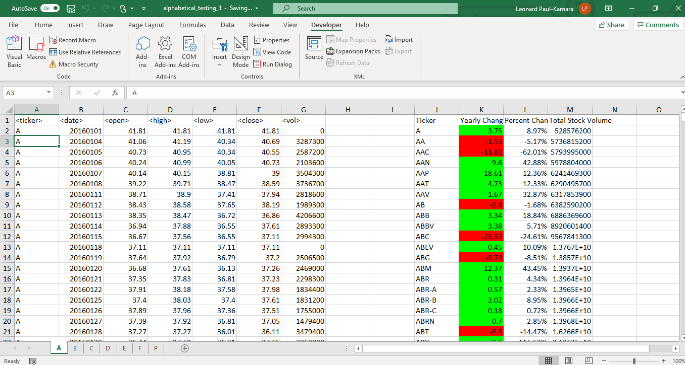
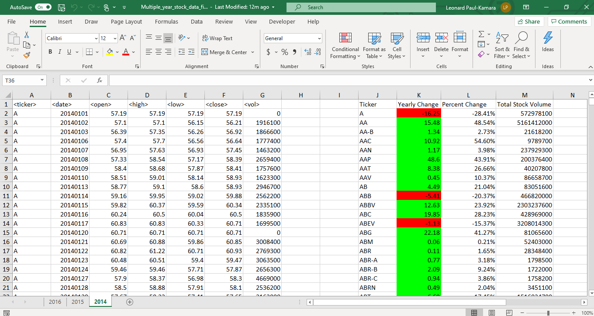

# vba_challenge
Repo for vba codes and files

### Stock Market Analysis Challenge

### Summary

Stock market data of New York Stock Exchange in a workboodk laballed "Multiple_year_stock_data" was analyzed via completion of the following tasks:

 1. Create a script that will loop through all the stocks for one year and output the following information.

  *The ticker symbol.

  * Yearly change from opening price at the beginning of a given year to the closing price at the end of that year.

  * The percent change from opening price at the beginning of a given year to the closing price at the end of that year.

  * The total stock volume of the stock.

 2. Conditional formatting that will highlight positive change in green and negative change in red of yearly change between opening stock and closing stock price.
 
 3. Output of the following:
    * Greatest % increase
	* Greatest % decrease
	* Greatest total volume
 
 Two vb scripts are added with codes that automate the above tasks. Details of the files are seen in the files section.

### Results

* Test sheet results

* Multi year results

